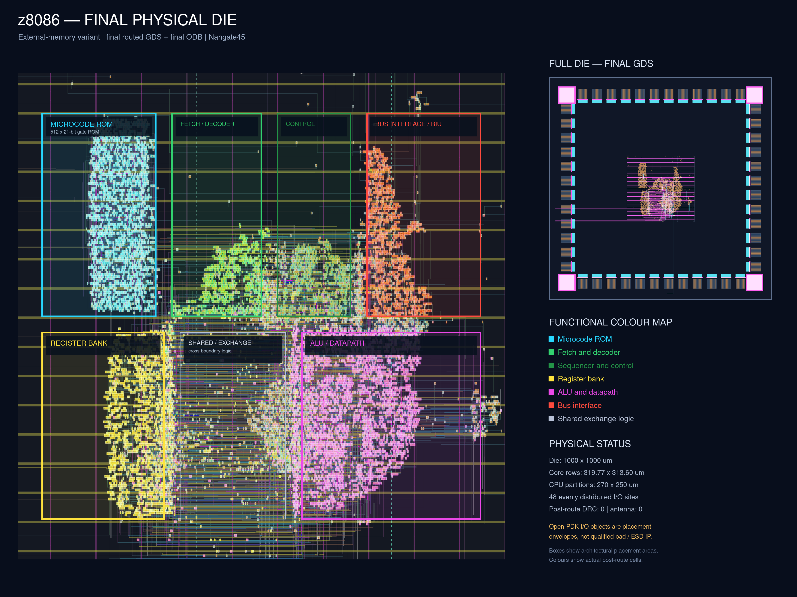
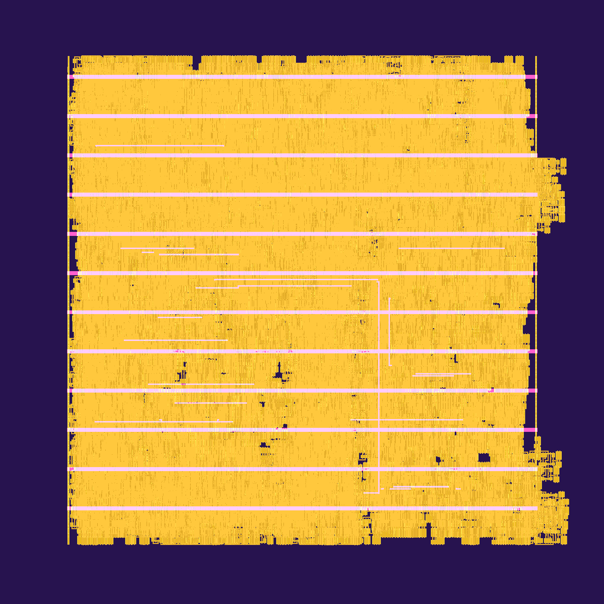

# z8086: FPGA 8086 Core Powered by Original Microcode

**z8086** is a FPGA-targeted implementation of the Intel 8086/8088 microprocessor. It executes the original 8086 microcode and provides a simplified memory/IO interface for FPGA integration.

## Overview

The z8086 core is a faithful implementation of the 8086 microprocessor architecture, using the original Intel microcode to ensure instruction-level compatibility. The core is written in SystemVerilog and designed to be vendor-agnostic (no FPGA-specific primitives).

### Key Features

- **Microcode-driven**: Executes the original 8086 microcode (21-bit words) loaded from `ucode.hex`
- **Simplified bus interface**: `rd/wr/io/word` with `ready` handshake; unaligned word accesses are automatically split internally
- **Prefetch queue**: 3-word (6-byte) prefetch queue with suspend/flush/correct-IP support
- **Parallel-prefix ALU**: Original per-bit Boolean equations evaluated by a four-level carry tree, with accurate flags (DAA/DAS/AAA/AAS, shifts/rotates, etc.)
- **FPGA-friendly**: Single clock, synchronous design, no vendor primitives

This project is still experimental. The core passes all single-instruction tests, achieving a 100% pass rate (16,150 out of 16,150 vectors) with full 8086 instruction set coverage—including arithmetic, logic, shifts, control flow, string operations, multiplication/division, interrupts, I/O, and BCD/ASCII adjust instructions. FPGA synthesis has been validated on Gowin GW5A, Xilinx Artix-7 and Altera Cyclone-V platforms. Note that current limitations include non-cycle-accurate timing, no LOCK pin support, and no coprocessor interface.

**Resource usage**: ~1800 LUTs on Xilinx Artix7, ~1200 ALMs on Altera Cyclone V, ~2500 LUTs on Gowin GW5A. One BRAM block is used for the microcode. The code is about 1800 lines of SystemVerilog.

### Architecture


The z8086 maintains the logical distinction between BIU (Bus Interface Unit) and EU (Execution Unit) but implements them in a unified datapath. The core includes:

- **Microcode Engine**: Fetches micro-instructions from the 512-word ROM (with address compression) and orchestrates all key CPU operations
- **Loader State Machine**: Manages instruction fetch timing (FC/SC signals)
- **Prefetch Queue**: 6-byte circular buffer for instruction prefetching
- **ALU**: 16-bit arithmetic/logic unit with comprehensive flag support
- **Memory Interface**: Unified bus FSM that arbitrates EU data operations vs instruction fetch

<!-- For detailed architecture documentation, see [`doc/z8086.md`](../../doc/z8086.md). -->

## Source Files

The core implementation is located in `src/`:

- **`src/z8086/z8086.sv`**: Main CPU core
- **`src/z8086/microcode_rom.sv`**: Synchronous microcode ROM and foundry-macro boundary
- **`src/z8086/alu.sv`**: 16-bit ALU and flag computation
- **`src/z8086/ucode.hex`**: Microcode ROM image (512 × 21-bit words)
- **`src/soc/z8086_top.sv`**: Example SoC top-level with memory interface
- **`src/soc/spram.sv`**: Simple single-port RAM for memory subsystem

## Simulation Testing

To run simulations, build the Verilator testbench and use the provided Python runners in `tests/`. Prerequisites: Verilator 4.0+, C++ compiler, make, Python 3.

**Build simulator and prepare test data:**
```bash
cd tests
make -s build
wget https://github.com/nand2mario/z8086/releases/download/v0.1/8088.tar.gz
tar xzf 8088.tar.gz
```

**Test an instruction:**
```bash
python3 test8088.py -f 8088/10.json -v    # single opcode/file
```

- `-f <file>`: test file (JSON)
- `-v`: verbose
- `-i <case>`: specific test case
- `-n <count>`: limit the number of vectors per opcode file (all vectors run by default)

**Test all instructions:**
```bash
python3 test8088.py
```

**Run small program tests:**
```bash
python3 test186.py
```

**Run interrupt test:**
```bash
make sim-int
```
(Exercises the INTA cycle and vector fetch.)

## FPGA Board Testing

FPGA board projects are in the `boards/` directory:

- **Tang Console 60K (Gowin GW5AT-60B)**: `z8086_console60k.gprj` (Gowin IDE). Drives LED pmod or Muse Labs LCD pmod. Press S1 button to start.
- **MicroPhase XC7A35T (Artix-7)**: `z8086.xpr` (Vivado 2021.1). Drives onboard LED. For LCD, see photo linked below for connections. Press K1 button to start.
- **DE10-Nano (Cyclone V)**: `z8086.qpf` (Quartus Prime). Drives onboard LED. For LCD, see photo linked below for connections. Press KEY0 to start.

See LCD demo screenshots: DE10-Nano, [Tang Console 60K](doc/tang_lcd.jpg), [MicroPhase Artix7](doc/microphase_lcd.jpg), [DE10-Nano](doc/de10nano_lcd.jpg).

## Example SoC Integration

The `src/soc/z8086_top.sv` module shows how to integrate the z8086 core:

```systemverilog
z8086 cpu (
    .clk(clk50),
    .reset_n(cpu_reset),
    .addr(addr),
    .din(din),
    .dout(dout),
    .wr(wr),
    .rd(rd),
    .io(io),
    .word(word),
    .ready(ready),
    .intr(1'b0),
    .nmi(1'b0),
    .inta()
);

// Memory subsystem
spram #(.AWIDTH(16)) ram (
    .clk(clk50),
    .addr(addr[15:0]),
    .din(dout),
    .dout(din),
    .we(wr & ~io),
    .oe(rd & ~io)
);
```

Here are the memory interface:

**Signals:**
- `addr[19:0]`: 20-bit physical address
- `din[15:0]`: Data input from memory/IO
- `dout[15:0]`: Data output to memory/IO
- `rd`: Read strobe (active high)
- `wr`: Write strobe (active high)
- `io`: 1=I/O access, 0=memory access
- `word`: 1=16-bit access, 0=8-bit access
- `ready`: Memory/IO ready (handshake)

**Bus Protocol:**
1. The z8086 core asserts `rd` (read) or `wr` (write) along with valid `addr`, `word`, and `io` signals.
2. The external memory or I/O subsystem initiates and completes the requested operation.
3. When the operation is finished, the external logic sets `ready=1`. For reads, data must be present on `din`.
4. `rd`, `wr`, and `inta` are one-clock request strobes. The external subsystem must latch the request and may return `ready` in a later cycle.
5. The core automatically splits unaligned memory and I/O word accesses into two sequential byte operations. External systems will **never see** unaligned word accesses (`word` and `addr[0]` will not both be 1).
6. **Interrupt Handling:** When INTR is raised, the core triggers two INTA (interrupt acknowledge) bus cycles in accordance with the 8086 protocol. For each INTA cycle, the CPU asserts INTA. After the second INTA, external logic should place the interrupt vector number on `din` and assert `ready=1` to complete the transaction.

## Programming the z8086

The example SoC in `z8086_top.sv` and the `programs/` directory demonstrate one way of programming the core, backed by FPGA BRAM.

### Firmware Build & Load Flow

1. **Write your firmware:** Create your program in 8086 assembly language. You can find example programs in the `programs/` directory.
2. **Build the firmware:**
   - Use the Makefile in `programs/` to automate the build process. The Makefile invokes [NASM](https://www.nasm.us/) to assemble `.asm` sources into `.bin` binaries.
   - These binaries are then converted to `.hex` format for FPGA loading.
3. **Understanding the memory map and program loading:**
   - The system is configured with 128KB of main memory. Even-numbered segments map to the lower 64KB ("data segment"), while odd-numbered segments map to the upper 64KB ("program segment").
   - When building, the `program.hex` output places an empty 64KB in the first half, and the assembled program in the second 64KB. 
   - The SoC module `z8086_top.sv` uses `$readmemh` to load the `.hex` directly into FPGA RAM.
   - A reset vector trampoline (far jump to F000:0000) is at the end of the second page (offset FFF0).
4. **Boot procedure:** Upon reset, the CPU sets CS:IP to FFFF:0000 and executes that far jump. Execution then continues from F000:0000, the start of the user program, which is correctly mapped to the program segment.

### Example Programs

Several example firmware files are included in the `programs/` directory:
- `blinky.asm`: Minimal example toggling LEDs and counting up.
- `lcd_bars.asm`: Demonstrates basic LCD display functionality.
- `lcd_shapes.asm`: Repeated square drawing.

Refer to these examples as starting points for your own programs, and consult `z8086_top.sv` for detailed integration.

## HDMI SoC demo

This is a larger demo: a complete 8086-compatible SoC featuring HDMI video output, UART communication, and C firmware (as opposed to the assembly-only firmware used in previous examples). It currently targets the Tang Console 60K. The Gowin project file is located at `boards/Tang Console 60K.soc_hdmi`, with source files in `src/soc_hdmi`, and firmware in `programs/soc_hdmi.c`.

```
┌───────────────────────────────────────────────────────┐
│                  z8086  soc_hdmi                      │
│  ┌──────────┐    ┌──────────┐    ┌─────────────────┐  │
│  │  z8086   │◄──►│   RAM    │    │   z8086hdmi     │  │
│  │   CPU    │    │  128KB   │    │  Video Engine   │-─┼──► HDMI
│  └──────────┘    └──────────┘    │  - Font ROM     │  │
│       │                          │  - VRAM (4KB)   │  │
│       │          ┌──────────┐    │  - Color Palette│  │
│       └─────────►│ uart_    │    └─────────────────┘  │
│                  │ simple   │────────────────────────-┼──► UART
│                  └──────────┘                         │
│                                                       │
│  Clocks: 50MHz (logic) → 74.25MHz (pixel) → 371.25MHz │
└───────────────────────────────────────────────────────┘
```

The firmware accepts simple commands such as: `led` (controlling on-board LED), `text` (print colorful text), `blink` (enable blinking text attributes). And of course, don’t miss **Snake** 😁 — written in C and compiled to real 8086 code.


### Run the Snake firmware in Verilator

The HDMI demo can also run without FPGA-specific PLL, TMDS, VRAM, or UART
primitives. The terminal testbench loads the real `soc_hdmi.hex` firmware,
maps its text VRAM into an ANSI terminal, and forwards keyboard input through
the emulated UART:

```bash
cd tests
make -s build-soc
make -s sim-soc
```

Use `W`, `A`, `S`, and `D` to move, `Q` to leave the game, and `Esc` to stop
the simulator. The terminal must have stdin attached to a TTY.

The interactive mode shortens only the five firmware delay-loop immediates
in the simulation RAM, from 20,000 to 2,000 iterations, so movement remains
responsive under Verilator. The checked-in `soc_hdmi.hex` is not modified.
The simulated delay can be adjusted directly:

```bash
./obj_dir/Vtb_soc_headless +interactive=1 +command=snake +keys=x \
  +snake_delay=2000
```

- `+command=<text>` selects the initial console command (`snake`, `help`, etc.).
- `+keys=<text>` supplies scripted keys before live keyboard input begins.
- `+redraw=<cycles>` controls the ANSI screen refresh interval.
- `+snake_delay=<count>` controls the accelerated Snake delay loop.
- `+trace` writes `soc_headless.fst`.

For automated regression or a deterministic text snapshot without a TTY:

```bash
make -s sim-soc-headless
```

## Experimental Nangate45 ASIC flow

The frozen commercial tapeout-readiness architecture is documented in
[`doc/asic_tapeout_target.md`](doc/asic_tapeout_target.md).  It targets a
TSMC 28 nm HPC implementation with external-memory and 1 MiB on-die-SRAM chip
tops, while keeping all proprietary foundry IP behind explicit replacement
boundaries.

The repository contains three reproducible OpenROAD-flow-scripts variants using
a digest-pinned Docker image:

- `z8086`: compact logic-only CPU with the original 20-bit external memory bus.
- `z8086_external_chip_core`: external-memory CPU inside a 1 mm square die,
  with 48 evenly distributed I/O envelopes, four corner envelopes, and a
  centred standard-cell island.
- `z8086_chip`: CPU plus a 1 MiB on-die SRAM hierarchy built from 256
  `fakeram45_1024x32` macros.



This annotated physical view makes the complete 1000 × 1000 µm
external-memory die readable without inventing an architectural drawing. The
large CPU view combines real diffusion, polysilicon, M2-M8 routing and PDN
geometry from the final GDS with functional standard cells highlighted at
their final ODB coordinates. The labelled outlines are the architectural
placement areas for the microcode ROM, fetch/decoder, sequencer/control,
register bank, ALU/datapath, shared exchange logic and bus interface. Six are
real global-placement guides; shared exchange logic is the centrally seeded
movable population required by RePlAce. The full final GDS remains visible
as the inset. Only non-functional `FILLCELL` instances are hidden while
rendering; neither the GDS nor the ODB on disk is modified. The finish stage
also rereads the merged GDS and rejects it unless the die is 1000 × 1000 µm and
a reference `DFF_X1` is 3.46 × 1.63 µm, preventing silent database-unit scaling
errors.

The sheet shows the four corner envelopes, 12 I/O envelopes on each side, and
the 319.77 × 313.60 µm core-row island at the centre. Its seven
architectural placement areas occupy a compact 270 × 250 µm rectangle,
with deliberate routing channels between the ROM, fetch/decode, control, BIU,
register, exchange and datapath areas. The empty moat is
intentional: it reserves the process-dependent I/O, ESD, power-ring and
seal-ring domain. Nangate45 does not provide manufacturable pad/ESD cells, so
the visible perimeter cells are explicitly non-electrical placement/GDS
envelopes; a commercial flow must replace them with the TSMC 28 nm I/O kit and
reconnect the routed boundary terminals. Rebuild this exact sheet with:

```bash
FLOW_VARIANT=padframe_v16_2ns make -s asic-tapeout-die-photo
```



This is a direct KLayout capture of the signed-off logic-only GDS. Functional
standard cells, clock/power structures, routed metals, and boundary terminals
retain their final physical coordinates. Only non-functional `FILLCELL` masters
are hidden in-memory so the CPU placement remains visible; the GDS on disk is
never modified. The current design has routing terminals but still needs a
process-specific pad/ESD/seal ring. Rebuild the checked-in PNG with
`make -s asic-die-photo`.

Current typical-corner post-route reference results are:

| Variant | Die | Signoff constraint | Extracted minimum-period estimate | Fmax estimate | Final design area | DRC / antenna |
|---|---:|---:|---:|---:|---:|---:|
| external-memory core | 220 × 220 µm | 1.50 ns | 1.48 ns | 675.06 MHz | 12,545 µm² | 0 / 0 |
| external-memory die + I/O envelopes | 1000 × 1000 µm | 2.00 ns | 1.98 ns | 505.02 MHz | 14,043 µm² | 0 / 0 |
| 1 MiB on die | 3300 × 2700 µm | 8.00 ns | 3.53 ns | 283.01 MHz | 4,273,857 µm² | 0 / 0 |

The compact external-core result uses a 1.5 ns constraint.  The complete-die
result uses a 2.0 ns constraint and includes CTS, detailed routing, fill, RC
extraction and GDS merge.  It closes with no setup, hold, slew, fanout,
capacitance, detailed-route DRC, or antenna violations.  Its deliberately
partitioned CPU uses 368,840 µm of detailed-route wire and 96,366 vias. Its
academic typical-corner analysis reports 5.91 mW, 4.06 mV worst VDD drop, and
3.88 mV worst VSS rise. These values describe this Nangate45 experiment, not TSMC
28 nm silicon.

The microcode ROM image is unchanged and is pinned by `make microcode-check`.
Its generic implementation is now a separate synchronous `microcode_rom`
physical-IP boundary; Nangate45 maps it to gates, while the commercial flow is
expected to replace it with a compiled 512 x 21-bit mask ROM. The ALU speedup
comes from replacing the
physical ripple recurrence with an equivalent four-level parallel-prefix tree;
no pipeline stage or architectural cycle was added.

The on-die result uses connectivity-derived placement for the CPU, SRAM
controller, and 64 local SRAM tile cones.  Its 153 signal pins are split into
ordered functional banks with routing gaps instead of being collapsed by the
HPWL optimizer.  The CPU's 560 classified cells are physically organized as
four non-overlapping partitions: decode/control, register bank, ALU/datapath,
and BIU/shared logic.  Their final centroid is (1643.89, 1358.04) µm, only
10.1 µm from the centre of the 3300 × 2700 µm die.  The BIU alone is allowed to
spill toward the external-IO side to avoid manufacturing a long output path.

The organized placement reaches 301.87 MHz before CTS and 283.01 MHz after
detailed routing and extracted-RC signoff.  That final estimate is 5.87% above
the preceding soft-guide result (267.32 MHz), at the cost of increasing routed
wire length from 6,043,088 to 6,968,231 µm (+15.31%).  Final design area changes
by only 210 µm² (+0.005%).  This is an intentional frequency-versus-wire trade:
the architectural blocks remain visible and centred without adding a pipeline
stage, changing bus latency, or modifying the original microcode.

The routed design has zero global congestion, zero detailed-route DRC, zero
antenna violations, 0.18% worst VDD drop, 0.23% worst VSS rise, and no final
timing or electrical violations.  The 283.01 MHz value is a minimum-period
estimate from the warning-free 8 ns signoff run; a tighter constraint sweep is
still required before claiming that frequency as a closed target.  The RAM
controller has one consolidated Verilator regression covering all 256 physical
banks, loader accesses, byte strobes, CPU byte lanes, and both word halves; it
runs as part of `make test` rather than as many small test executables.

```bash
# Complete external-memory flow and real standard-cell GDS
FLOW_VARIANT=prefix_compact_1p5ns Z8086_CLOCK_PERIOD_NS=1.5 \
  make -s asic-external-finish

# Complete the optimized, architecturally seeded on-die-SRAM analysis
FLOW_VARIANT=incremental_cpu_blocks_8ns Z8086_CLOCK_PERIOD_NS=8.0 \
  make -s asic-finish

# Convert die, CPU architecture, routing, clock, IR and hotpath maps to PNG
FLOW_VARIANT=prefix_compact_1p5ns make -s asic-external-render
FLOW_VARIANT=incremental_cpu_blocks_8ns make -s asic-render

# Capture the signed-off external-memory GDS directly through KLayout
make -s asic-die-photo

# Build and photograph the full external-memory die with I/O envelopes
FLOW_VARIANT=padframe_v16_2ns Z8086_CLOCK_PERIOD_NS=2.0 \
  make -s asic-tapeout-finish
FLOW_VARIANT=padframe_v16_2ns make -s asic-tapeout-die-photo
```

Every flow diagnostic is fatal: the scripts do not waive or suppress warnings.
Final checks also require zero timing/electrical violations, zero detailed-route
DRC, and zero antenna violations.

Nangate45 and FakeRAM are academic views, not a foundry-qualified tapeout kit.
The logic-only and external-memory die variants produce GDS.  The latter uses
clearly marked placeholder perimeter geometry, not a qualified I/O library.
FakeRAM supplies LEF/Liberty but no SRAM GDS, so the 1 MiB variant intentionally
produces ODB/DEF/SPEF/STA/IR results; a real tapeout must substitute foundry I/O,
ESD, ROM, SRAM and seal-ring views, then repeat multi-corner signoff.

## Documentation

* Blog post: [z8086: Rebuilding the 8086 from Original Microcode](https://nand2mario.github.io/posts/2025/z8086/)

<!-- - **[`doc/z8086.md`](../../doc/z8086.md)**: Comprehensive developer guide covering architecture, microcode, implementation details, and signal reference -->

## Acknowledgements

z8086 would not have been possible without the outstanding reverse engineering work of [Ken Shirriff](https://www.righto.com/search/label/808) and [Andrew Jenner](https://www.reenigne.org/blog/8086-microcode-disassembled/).

## Cite

```bibtex
@misc{z8086,
  title        = {z8086: FPGA 8086 Core Powered by Original Microcode},
  author       = {nand2mario},
  year         = {2025},
  url          = {https://github.com/nand2mario/z8086}
}
```

## Can I use this in a commercial project?

z8086 was developed primarily as an educational and learning tool. For broader or commercial use, the main limitation is the copyright status of the original 8086 microcode. Ideally, Intel would formally release the rights to this significant historical code.

As for z8086 itself, I have chosen to release it under the permissive
[Apache 2.0 license](LICENSE). The license status of the original-derived
`src/z8086/ucode.hex` remains the separate concern described above.
